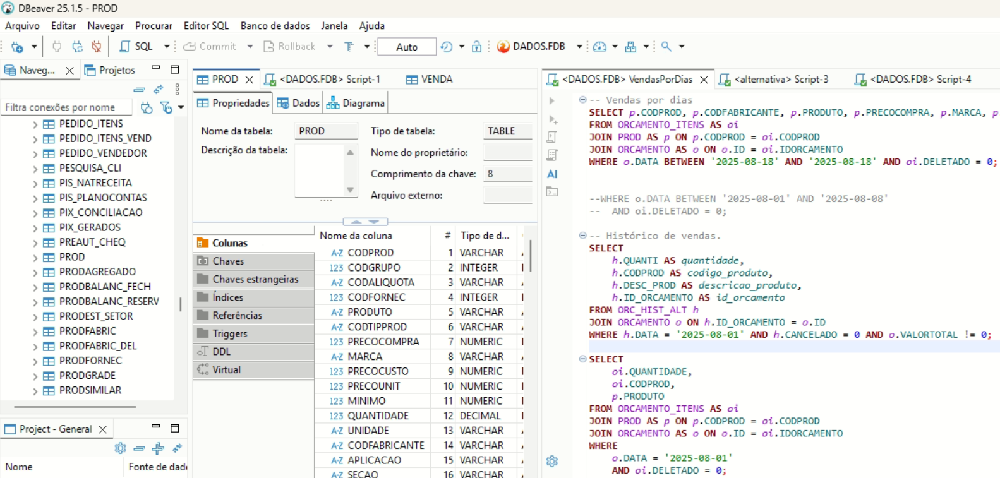

# Integração com Banco de Dados Firebird 2.5.9

Este projeto mostra como realizar conexão e consultas em um banco de dados **Firebird 2.5.9** utilizando **Python** e a biblioteca [`fdb`](https://pypi.org/project/fdb/).

## 🚀 Tecnologias
- Python 3.x
- Firebird 2.5.9
- Biblioteca `fdb`
- DBeaver Community (auxílio na exploração da estrutura do banco)

## Imagem DBeaver


## ⚙️ Requisitos
Instale as dependências com:
```bash
pip install -r requirements.txt
```

## Ⓜ️ Como utilizar
Altere as variáveis de configurações para conexão com o Banco de Dados: <br> <br>
<b> 
HOST = "HOST" <br>
BD_PATH = "CAMINHO_ARQUIVO.FDB" <br>
USER_BD = "user" <br>
PASSWORD_BD = "password" <br>